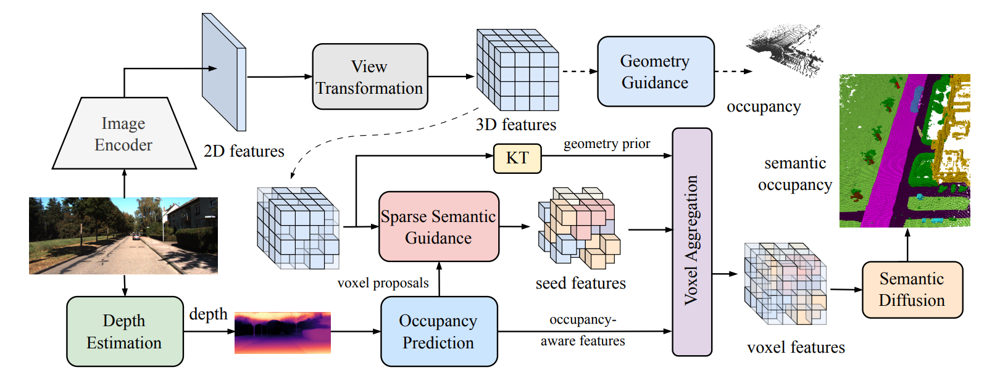

<div align="center">   
  
# Camera-based Semantic Scene Completion with Sparse Guidance Network
</div>

> **Camera-based Semantic Scene Completion with Sparse Guidance Network**. 

>  [[Arxiv]](https://arxiv.org/pdf/2312.05752.pdf)


## News
- [2024/09]: Accepted by IEEE TIP 2024!
- [2023/12]: We release the evaluation results and training code for SSCBench-KITTI-360.
- [2023/12]: Our paper is on [arxiv](https://arxiv.org/pdf/2312.05752.pdf).
- [2023/08]: SGN achieve the SOTA on Camera-based [SemanticKITTI 3D SSC (Semantic Scene Completion) Task](http://www.semantic-kitti.org/tasks.html#ssc) with **15.76% mIoU** and **45.52% IoU**.
</br>


## Abstract
Semantic scene completion (SSC) aims to predict the semantic occupancy of each voxel in the entire 3D scene from limited observations, which is an emerging and critical task for autonomous driving. Recently, many studies have turned to camera-based SSC solutions due to the richer visual cues and cost-effectiveness of cameras. However, existing methods usually rely on sophisticated and heavy 3D models to process the lifted 3D features directly, which are not discriminative enough for clear segmentation boundaries. In this paper, we adopt the dense-sparse-dense design and propose a one-stage camera-based SSC framework, termed SGN, to propagate semantics from the semantic-aware seed voxels to the whole scene based on spatial geometry cues. Firstly, to exploit depth-aware context and dynamically select sparse seed voxels, we redesign the sparse voxel proposal network to process points generated by depth prediction directly with the coarse-to-fine paradigm. Furthermore, by designing hybrid guidance (sparse semantic and geometry guidance) and effective voxel aggregation for spatial geometry cues, we enhance the feature separation between different categories and expedite the convergence of semantic propagation. Finally, we devise the multi-scale semantic propagation module for flexible receptive fields while reducing the computation resources. Extensive experimental results on the SemanticKITTI and SSCBench-KITTI-360 datasets demonstrate the superiority of our SGN over existing state-of-the-art methods. And even our lightweight version SGN-L achieves notable scores of 14.80\% mIoU and 45.45\% IoU on SeamnticKITTI validation with only 12.5 M parameters and 7.16 G training memory.


## Method

|  | 
|:--:| 
| ***Figure 1. Overall framework of SGN**. The image encoder extracts 2D features to provide the foundation for 3D features lifted by the view transformation. Then auxiliary occupancy head is applied to provide geometry guidance. Before sparse semantic guidance, depth-based occupancy prediction is utilized for voxel proposals of indexing seed features. Afterward, the voxel aggregation layer forms the informative voxel features processed by the multi-scale semantic diffusion for the final semantic occupancy prediction. KT denotes the knowledge transfer layer for geometry prior.* |

## Getting Started
### Installation
Please refer to [Voxformer](https://github.com/NVlabs/VoxFormer) to create base environment. Some extra packages are needed to be installed:  
- spconv-cu111==2.1.25  
- torch-scatter==2.0.8  
- tochmetrics>=0.9.0  
### Prepare Dataset
Please refer to the [README](preprocess/README.md) in the preprocess folder for details.
### Run and Eval
  
Train SGN with 4 GPUs 
```
./tools/dist_train.sh ./projects/configs/sgn/sgn-T-one-stage-guidance.py 4
```

Eval SGN with 4 GPUs
```
./tools/dist_test.sh ./projects/configs/sgn/sgn-T-one-stage-guidance.py ./path/to/ckpts.pth 4
```

## Model Zoo
| Backbone | Dataset| Method | IoU| mIoU | Params (M) | Config | Download |
| :---: | :---: | :---: | :---: | :---:| :---: | :---: | :---: |
| R50 | Sem.KITTI val/test| SGN-T |46.21/45.42| 15.32/15.76|28.2 |[config](./projects/configs/sgn/sgn-T-one-stage-guidance.py) |[model](https://drive.google.com/file/d/1cDKX6SpyoAHr-cfmjTRDsNF-3_JgtH3p/view?usp=drive_link) 
| R50 | KITTI360 val/test| SGN-T |47.50/47.06 | 19.07/18.25| 28.2 | [config](./projects/configs/sgn/sgn-T-one-stage-guidance-kitti360.py) |[model](https://drive.google.com/file/d/1pfS_9FPsXuUbT1m2tMqSowFN2iEA6KdB/view?usp=drive_link) 
| R18 | Sem.KITTI val/test| SGN-L | 45.45/43.71| 14.80/14.39| 12.5 |[config](./projects/configs/sgn/sgn-L-one-stage-guidance.py) |[model](https://drive.google.com/file/d/1qcjU-vQEju1ycL6NSmq1o53BuI8iYMaK/view?usp=drive_link)|
| R18 | KITTI360 val/test| SGN-L | 46.67/46.64 | 17.11/16.95 | 12.5 |[config](./projects/configs/sgn/sgn-L-one-stage-guidance-kitti360.py) |[model](https://drive.google.com/file/d/1hdR4gMDK4-NyulFDWUNPcLhEImNie8nI/view?usp=drive_link)|
| R50 | Sem.KITTI val/test| SGN-S | 43.60/41.88| 14.55/14.01| 28.2 |[config](./projects/configs/sgn/sgn-S-one-stage-guidance.py) |[model](https://drive.google.com/file/d/1nSh3b69zymabIKmc0L8gGNaEY7RA95T2/view?usp=drive_link)|
| R50 | KITTI360 val/test| SGN-S |46.13/46.22 |18.29/17.71 | 28.2 | [config](./projects/configs/sgn/sgn-S-one-stage-guidance-kitti360.py) |[model](https://drive.google.com/file/d/1WrvxWCq3EY2zRgLoW6JpLNawyiUr2SdD/view?usp=drive_link)|

Note that we used the checkpoints that performed best on the validation set during training to evaluate SGN on the test sets for both SemanticKITTI and SSCBench-KITTI-360 datasets.
 
## TODO

- [x] SemanticKITTI
- [x] SSCBench-KITTI-360
- [ ] Data augmentation

## Acknowledgement

Many thanks to these excellent open source projects:
- [VoxFormer](https://github.com/NVlabs/VoxFormer)
- [mmdet3d](https://github.com/open-mmlab/mmdetection3d)
- [MonoScene](https://github.com/astra-vision/MonoScene)
- [AICNet](https://github.com/waterljwant/SSC)

## Ciatation

If you find this project helpful, please consider citing the following paper:
```
@article{mei2024camera,
  title={Camera-based 3d semantic scene completion with sparse guidance network},
  author={Mei, Jianbiao and Yang, Yu and Wang, Mengmeng and Zhu, Junyu and Ra, Jongwon and Ma, Yukai and Li, Laijian and Liu, Yong},
  journal={IEEE Transactions on Image Processing},
  year={2024},
  publisher={IEEE}
}
```
